# Arsitektur Informasi & Sitemap - MA Malnu Kananga

## Sitemap Website

```mermaid
graph TD
    A[Homepage] --> B[Profil]
    A --> C[Akademik]
    A --> D[Berita]
    A --> E[Pengumuman]
    A --> F[Prestasi]
    A --> G[Galeri]
    A --> H[Guru & Staf]
    A --> I[PPDB]
    A --> J[Kontak]
    
    B --> B1[Sejarah]
    B --> B2[Visi Misi]
    B --> B3[Fasilitas]
    B --> B4[Struktur Organisasi]
    
    C --> C1[Kurikulum]
    C --> C2[Ekstrakurikuler]
    C --> C3[Jadwal Pelajaran]
    C --> C4[Kalender Akademik]
    
    D --> D1[Kategori Berita]
    D --> D2[Detail Berita]
    
    E --> E1[Kategori Pengumuman]
    E --> E2[Detail Pengumuman]
    
    F --> F1[Prestasi Akademik]
    F --> F2[Prestasi Non-Akademik]
    F --> F3[Detail Prestasi]
    
    G --> G1[Foto Kegiatan]
    G --> G2[Video Dokumentasi]
    G --> G3[Galeri Khusus]
    
    H --> H1[Daftar Guru]
    H --> H2[Daftar Staf]
    H --> H3[Profil Detail]
    
    I --> I1[Info PPDB]
    I --> I2[Syarat & Ketentuan]
    I --> I3[Biaya & Pembayaran]
    I --> I4[Jadwal PPDB]
    I --> I5[Formulir Pendaftaran]
    I --> I6[Hasil Seleksi]
    
    J --> J1[Lokasi Sekolah]
    J --> J2[Jam Operasional]
    J --> J3[FAQ]
    J --> J4[Kebijakan Privasi]
```



## Struktur URL & Slug

### Halaman Utama
| Halaman | URL | Slug |
|---------|-----|------|
| Beranda | `/` | - |
| Profil Sekolah | `/profil` | `/profil` |
| Akademik | `/akademik` | `/akademik` |
| Berita | `/berita` | `/berita` |
| Pengumuman | `/pengumuman` | `/pengumuman` |
| Prestasi | `/prestasi` | `/prestasi` |
| Galeri | `/galeri` | `/galeri` |
| Guru & Staf | `/guru-staf` | `/guru-staf` |
| PPDB | `/ppdb` | `/ppdb` |
| Kontak | `/kontak` | `/kontak` |

### Sub-halaman Profil
| Halaman | URL | Slug |
|---------|-----|------|
| Sejarah | `/profil/sejarah` | `/profil/sejarah` |
| Visi Misi | `/profil/visi-misi` | `/profil/visi-misi` |
| Fasilitas | `/profil/fasilitas` | `/profil/fasilitas` |
| Struktur Organisasi | `/profil/struktur` | `/profil/struktur` |

### Sub-halaman Akademik
| Halaman | URL | Slug |
|---------|-----|------|
| Kurikulum | `/akademik/kurikulum` | `/akademik/kurikulum` |
| Ekstrakurikuler | `/akademik/ekstrakurikuler` | `/akademik/ekstrakurikuler` |
| Jadwal Pelajaran | `/akademik/jadwal` | `/akademik/jadwal` |
| Kalender Akademik | `/akademik/kalender` | `/akademik/kalender` |

### Halaman Berita & Pengumuman
| Halaman | URL | Slug |
|---------|-----|------|
| List Berita | `/berita` | `/berita` |
| Detail Berita | `/berita/{slug}` | `/berita/{judul-berita}` |
| Kategori Berita | `/berita/kategori/{slug}` | `/berita/kategori/{nama-kategori}` |
| List Pengumuman | `/pengumuman` | `/pengumuman` |
| Detail Pengumuman | `/pengumuman/{slug}` | `/pengumuman/{judul-pengumuman}` |

### Halaman Prestasi
| Halaman | URL | Slug |
|---------|-----|------|
| List Prestasi | `/prestasi` | `/prestasi` |
| Detail Prestasi | `/prestasi/{slug}` | `/prestasi/{judul-prestasi}` |
| Prestasi Akademik | `/prestasi/akademik` | `/prestasi/akademik` |
| Prestasi Non-Akademik | `/prestasi/non-akademik` | `/prestasi/non-akademik` |

### Halaman Galeri
| Halaman | URL | Slug |
|---------|-----|------|
| Galeri Foto | `/galeri` | `/galeri` |
| Album Khusus | `/galeri/{slug}` | `/galeri/{nama-album}` |
| Galeri Video | `/galeri/video` | `/galeri/video` |

### Halaman Guru & Staf
| Halaman | URL | Slug |
|---------|-----|------|
| Daftar Guru | `/guru-staf/guru` | `/guru-staf/guru` |
| Daftar Staf | `/guru-staf/staf` | `/guru-staf/staf` |
| Profil Detail | `/guru-staf/{slug}` | `/guru-staf/{nama-lengkap}` |

### Halaman PPDB
| Halaman | URL | Slug |
|---------|-----|------|
| Info PPDB | `/ppdb` | `/ppdb` |
| Syarat & Ketentuan | `/ppdb/syarat` | `/ppdb/syarat` |
| Biaya & Pembayaran | `/ppdb/biaya` | `/ppdb/biaya` |
| Jadwal PPDB | `/ppdb/jadwal` | `/ppdb/jadwal` |
| Formulir Pendaftaran | `/ppdb/daftar` | `/ppdb/daftar` |
| Hasil Seleksi | `/ppdb/hasil` | `/ppdb/hasil` |

### Halaman Kontak
| Halaman | URL | Slug |
|---------|-----|------|
| Kontak Utama | `/kontak` | `/kontak` |
| Lokasi Sekolah | `/kontak/lokasi` | `/kontak/lokasi` |
| Jam Operasional | `/kontak/jam` | `/kontak/jam` |
| FAQ | `/kontak/faq` | `/kontak/faq` |
| Kebijakan Privasi | `/kontak/kebijakan-privasi` | `/kontak/kebijakan-privasi` |

## Breadcrumb Navigation

### Format Breadcrumb
```
Beranda > [Kategori] > [Sub-kategori] > [Halaman]
```

### Contoh Implementasi Breadcrumb

1. **Halaman Detail Berita**
   ```
   Beranda > Berita > Meningkatkan Mutu Pendidikan di MA Malnu Kananga
   ```

2. **Halaman Profil Fasilitas**
   ```
   Beranda > Profil > Fasilitas
   ```

3. **Halaman Formulir PPDB**
   ```
   Beranda > PPDB > Formulir Pendaftaran
   ```

4. **Halaman Detail Guru**
   ```
   Beranda > Guru & Staf > Profil Guru > Dr. H. Ahmad Sanusi, M.Pd.
   ```

5. **Halaman Album Galeri**
   ```
   Beranda > Galeri > Perayaan Hari Santri Nasional 2024
   ```

## Rekomendasi Label Menu

### Menu Navigasi Utama (Desktop)
1. **Beranda** - `/`
2. **Profil ▼**
   - Sejarah - `/profil/sejarah`
   - Visi Misi - `/profil/visi-misi`
   - Fasilitas - `/profil/fasilitas`
   - Struktur Organisasi - `/profil/struktur`
3. **Akademik ▼**
   - Kurikulum - `/akademik/kurikulum`
   - Ekstrakurikuler - `/akademik/ekstrakurikuler`
   - Jadwal Pelajaran - `/akademik/jadwal`
   - Kalender Akademik - `/akademik/kalender`
4. **Berita** - `/berita`
5. **Pengumuman** - `/pengumuman`
6. **Prestasi** - `/prestasi`
7. **Galeri** - `/galeri`
8. **Guru & Staf** - `/guru-staf`
9. **PPDB ▼**
   - Info PPDB - `/ppdb`
   - Syarat & Ketentuan - `/ppdb/syarat`
   - Biaya & Pembayaran - `/ppdb/biaya`
   - Jadwal PPDB - `/ppdb/jadwal`
   - Daftar Online - `/ppdb/daftar`
   - Hasil Seleksi - `/ppdb/hasil`
10. **Kontak** - `/kontak`

### Menu Navigasi Mobile (Hamburger)
Struktur menu sama dengan desktop, namun disusun dalam accordion menu untuk menghemat ruang layar:
- Beranda
- Profil ▼
- Akademik ▼
- Berita
- Pengumuman
- Prestasi
- Galeri
- Guru & Staf
- PPDB ▼
- Kontak

### Menu Footer
#### Kolom 1: Profil
- Sejarah
- Visi Misi
- Fasilitas
- Struktur Organisasi

#### Kolom 2: Akademik
- Kurikulum
- Ekstrakurikuler
- Jadwal Pelajaran
- Kalender Akademik

#### Kolom 3: Informasi
- Berita
- Pengumuman
- Prestasi
- Galeri

#### Kolom 4: Layanan
- PPDB
- Guru & Staf
- Kontak
- FAQ

#### Kolom 5: Legal
- Kebijakan Privasi
- Syarat & Ketentuan
- Hak Cipta

## Struktur Data JSON-LD untuk SEO

### BreadcrumbList
```json
{
  "@context": "https://schema.org",
  "@type": "BreadcrumbList",
  "itemListElement": [
    {
      "@type": "ListItem",
      "position": 1,
      "name": "Beranda",
      "item": "https://www.malnukananga.sch.id/"
    },
    {
      "@type": "ListItem",
      "position": 2,
      "name": "Berita",
      "item": "https://www.malnukananga.sch.id/berita"
    },
    {
      "@type": "ListItem",
      "position": 3,
      "name": "Judul Berita",
      "item": "https://www.malnukananga.sch.id/berita/judul-berita"
    }
  ]
}
```

### Situs Web
```json
{
  "@context": "https://schema.org",
  "@type": "WebSite",
  "name": "MA Malnu Kananga",
  "url": "https://www.malnukananga.sch.id/",
  "potentialAction": {
    "@type": "SearchAction",
    "target": "https://www.malnukananga.sch.id/search?q={search_term_string}",
    "query-input": "required name=search_term_string"
  }
}
```

## Rekomendasi Struktur Folder untuk CMS

### Struktur Konten
```
/content
  /pages
    /profil
      sejarah.md
      visi-misi.md
      fasilitas.md
      struktur.md
    /akademik
      kurikulum.md
      ekstrakurikuler.md
      jadwal.md
      kalender.md
  /posts
    /berita
    /pengumuman
 /galleries
  /staff
  /ppdb
  /settings
```

### Struktur Media
```
/public
  /images
    /hero
    /facilities
    /events
    /staff
    /galleries
  /documents
    /curriculum
    /ppdb
  /icons
  /favicons
```

## Panduan Penamaan Konten

### Slug Artikel
- Gunakan kebab-case (dengan-tanda-hubung)
- Hanya huruf kecil, angka, dan tanda hubung
- Maksimal 50 karakter
- Deskriptif dan mengandung kata kunci utama

### Penamaan File Media
- Gunakan format: `deskripsi-tanggal.extension`
- Contoh: `upacara-bendera-2024-09-22.jpg`
- Hindari spasi dan karakter khusus

### Kategori & Tag
- Gunakan format title case untuk nama kategori
- Contoh: "Kegiatan Sekolah", "Prestasi Akademik"
- Tag menggunakan kebab-case
- Contoh: "kegiatan-sekolah", "prestasi-akademik"

## Rekomendasi Struktur Halaman Dinamis

### Halaman dengan Parameter Query
1. **Pencarian**: `/search?q={keyword}&category={category}`
2. **Filter Galeri**: `/galeri?year={year}&event={event}`
3. **Filter Guru**: `/guru-staf?subject={subject}&department={department}`
4. **Arsip Berita**: `/berita?year={year}&month={month}`

### Halaman dengan Pagination
1. **List Berita**: `/berita?page=2`
2. **List Pengumuman**: `/pengumuman?page=3`
3. **List Prestasi**: `/prestasi?page=1`
4. **List Galeri**: `/galeri?page=2`

## Rekomendasi Pengelompokan Konten

### Berdasarkan Jenis Konten
1. **Informasi Institusi**: Profil, Fasilitas, Struktur Organisasi
2. **Konten Akademik**: Kurikulum, Ekstrakurikuler, Jadwal
3. **Berita & Informasi**: Berita, Pengumuman, Prestasi
4. **Media**: Galeri, Video
5. **Komunitas**: Guru & Staf, Alumni (rencana)
6. **Layanan**: PPDB, Kontak, FAQ

### Berdasarkan Audiens
1. **Calon Siswa**: PPDB, Profil, Fasilitas
2. **Siswa Aktif**: Jadwal, Ekstrakurikuler, Pengumuman
3. **Orang Tua**: Berita, Prestasi, Kontak
4. **Guru & Staf**: Kalender Akademik, Pengumuman Internal
5. **Umum**: Profil, Berita, Galeri

---
*Dokumen ini merupakan panduan teknis untuk pengembangan arsitektur informasi website MA Malnu Kananga. Struktur ini dirancang untuk optimalisasi SEO, kemudahan navigasi pengguna, dan skalabilitas konten di masa depan.*