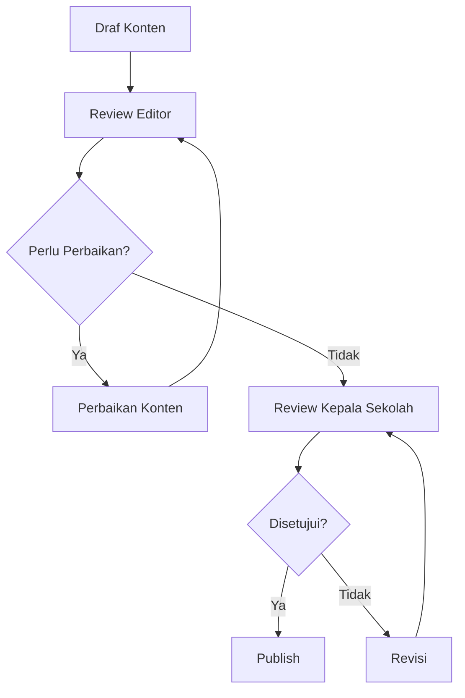

# Dokumentasi & Pelatihan - MA Malnu Kananga

## Panduan Singkat Bergambar untuk Editor CMS

### 1. Membuat Berita Baru

#### Langkah 1: Akses Dashboard CMS

- Login ke CMS Sanity menggunakan kredensial yang telah diberikan
- Pilih "Berita" dari menu navigasi kiri

#### Langkah 2: Buat Berita Baru

- Klik tombol "Create new" atau "+ New"
- Pilih tipe dokumen "Berita"

#### Langkah 3: Isi Informasi Dasar

- **Judul Berita**: Masukkan judul yang menarik dan informatif
- **Slug**: Otomatis terisi berdasarkan judul, bisa diedit jika perlu
- **Ringkasan**: Tulis excerpt singkat (max. 200 karakter)
- **Tanggal Publikasi**: Atur tanggal dan waktu publikasi
- **Kategori**: Pilih kategori yang sesuai
- **Penulis**: Pilih penulis dari daftar

#### Langkah 4: Upload Gambar Sampul

- Klik area upload gambar sampul
- Pilih gambar dari komputer (disarankan 1200x630px)
- Tunggu proses upload selesai
- Gambar otomatis dioptimalkan

#### Langkah 5: Tulis Konten Berita

- Gunakan editor rich text untuk menulis konten
- **Heading 1**: Judul utama (satu per artikel)
- **Heading 2**: Subjudul penting
- **Heading 3**: Subjudul pendukung
- **Paragraf**: Konten utama
- **List**: Untuk poin-poin penting
- **Quote**: Untuk kutipan penting

#### Langkah 6: Insert Gambar dalam Konten

- Klik ikon "+" di antara blok konten
- Pilih "Image"
- Upload gambar atau pilih dari library
- Tambahkan caption jika diperlukan
- Atur alignment (kiri, tengah, kanan)

#### Langkah 7: Publish Berita

- Klik tombol "Publish" di kanan atas
- Konfirmasi publish
- Berita akan langsung tampil di website

### 2. Membuat Pengumuman

#### Langkah 1: Akses Dashboard Pengumuman

- Pilih "Pengumuman" dari menu navigasi kiri
- Klik tombol "Create new"

#### Langkah 2: Isi Detail Pengumuman

- **Judul Pengumuman**: Jelas dan informatif
- **Ringkasan**: Deskripsi singkat
- **Tanggal Publikasi**: Otomatis tanggal hari ini
- **Pengumuman Penting**: Centang jika sangat penting
- **Isi Pengumuman**: Konten lengkap dengan format yang sesuai

#### Langkah 3: Lampirkan Dokumen (Opsional)

- Klik "Add attachment"
- Upload file PDF atau dokumen terkait
- File akan tersedia untuk diunduh pengunjung

#### Langkah 4: Publish Pengumuman

- Klik tombol "Publish"
- Pengumuman akan muncul di halaman pengumuman website

### 3. Mengunggah Galeri

#### Langkah 1: Buat Album Baru

- Pilih "Galeri" dari menu navigasi
- Klik "Create new" dan pilih "Album"

#### Langkah 2: Informasi Album

- **Judul Album**: Nama kegiatan atau acara
- **Deskripsi Album**: Penjelasan singkat
- **Tanggal Kegiatan**: Kapan kegiatan berlangsung
- **Gambar Sampul**: Gambar utama album

#### Langkah 3: Upload Gambar-Gambar

- Klik "Add images"
- Pilih beberapa gambar sekaligus
- Tunggu proses upload selesai
- Tambahkan keterangan untuk gambar penting

#### Langkah 4: Publish Album

- Klik tombol "Publish"
- Album akan tampil di halaman galeri website

## SOP Publikasi: Alur Proofreading & Approval

### 1. Alur Kerja Publikasi Konten



### 2. Tahapan Detail SOP

#### Tahap 1: Pembuatan Draft
**PIC**: Tim Konten/Editor
**Deadline**: 3 hari sebelum publish
**Aktivitas**:
1. Buat draft konten di CMS
2. Isi semua field yang diperlukan
3. Upload gambar dan media pendukung
4. Simpan sebagai draft (jangan publish)

#### Tahap 2: Review Editor
**PIC**: Editor Senior
**Deadline**: 2 hari sebelum publish
**Aktivitas**:
1. Baca dan koreksi konten
2. Periksa grammar dan ejaan
3. Pastikan format sesuai panduan
4. Cek konsistensi informasi
5. Beri feedback jika perlu perbaikan

#### Tahap 3: Perbaikan Konten
**PIC**: Penulis Konten
**Deadline**: 1 hari sebelum review kepala sekolah
**Aktivitas**:
1. Perbaiki konten berdasarkan feedback
2. Pastikan semua masukan telah diimplementasi
3. Simpan kembali sebagai draft

#### Tahap 4: Review Kepala Sekolah
**PIC**: Kepala Sekolah
**Deadline**: 1 hari sebelum publish
**Aktivitas**:
1. Tinjau konten secara menyeluruh
2. Pastikan sesuai visi dan nilai sekolah
3. Periksa akurasi informasi
4. Beri persetujuan atau minta revisi

#### Tahap 5: Publish
**PIC**: Administrator CMS
**Deadline**: Waktu publish yang ditentukan
**Aktivitas**:
1. Publish konten setelah disetujui
2. Verifikasi tampilan di website
3. Bagikan ke media sosial jika diperlukan
4. Arsipkan versi final

### 3. Checklist Proofreading

#### Konten dan Informasi
- [ ] Judul menarik dan informatif
- [ ] Ringkasan jelas dan mewakili isi
- [ ] Informasi akurat dan terkini
- [ ] Tidak ada broken link
- [ ] Grammar dan ejaan benar
- [ ] Gaya bahasa konsisten

#### Format dan Tampilan
- [ ] Heading structure logis
- [ ] Paragraf tidak terlalu panjang
- [ ] List digunakan untuk poin penting
- [ ] Quote digunakan untuk kutipan
- [ ] Gambar memiliki alt text
- [ ] Gambar beresolusi cukup tinggi

#### SEO dan Metadata
- [ ] Meta title < 60 karakter
- [ ] Meta description < 160 karakter
- [ ] Keyword utama digunakan dengan natural
- [ ] URL kanonis benar
- [ ] Structured data valid

#### Aksesibilitas
- [ ] Semua gambar memiliki alt text
- [ ] Kontras warna memenuhi WCAG AA
- [ ] Heading structure logis
- [ ] Link memiliki teks deskriptif

## Video/GIF Mini untuk Penggunaan Dashboard

### 1. Tutorial Membuat Berita Baru

#### GIF 1: Navigasi ke Halaman Berita
```
[Frame 1]: Klik menu "Berita" di sidebar
[Frame 2]: Halaman daftar berita muncul
[Frame 3]: Klik tombol "Create new"
[Frame 4]: Form berita baru terbuka
Durasi: 3 detik
```

#### GIF 2: Mengisi Informasi Dasar
```
[Frame 1]: Isi field "Judul Berita"
[Frame 2]: Slug otomatis terisi
[Frame 3]: Isi field "Ringkasan"
[Frame 4]: Pilih kategori dan penulis
Durasi: 4 detik
```

#### GIF 3: Upload Gambar Sampul
```
[Frame 1]: Klik area upload gambar
[Frame 2]: Dialog pemilihan file muncul
[Frame 3]: Pilih gambar dari komputer
[Frame 4]: Gambar berhasil diupload
Durasi: 3 detik
```

#### GIF 4: Menulis Konten Berita
```
[Frame 1]: Klik editor konten
[Frame 2]: Ketik paragraf pertama
[Frame 3]: Klik ikon "+" untuk menambah elemen
[Frame 4]: Pilih "Heading 2" dan ketik subjudul
Durasi: 4 detik
```

#### GIF 5: Publish Berita
```
[Frame 1]: Scroll ke atas halaman
[Frame 2]: Klik tombol "Publish"
[Frame 3]: Dialog konfirmasi muncul
[Frame 4]: Klik "Publish now"
[Frame 5]: Notifikasi berhasil muncul
Durasi: 3 detik
```

### 2. Tutorial Mengunggah Galeri

#### GIF 6: Membuat Album Baru
```
[Frame 1]: Klik menu "Galeri" di sidebar
[Frame 2]: Klik tombol "Create new"
[Frame 3]: Pilih "Album"
[Frame 4]: Form album baru terbuka
Durasi: 3 detik
```

#### GIF 7: Upload Gambar ke Album
```
[Frame 1]: Klik "Add images"
[Frame 2]: Pilih beberapa gambar
[Frame 3]: Gambar mulai diupload
[Frame 4]: Semua gambar berhasil diupload
Durasi: 4 detik
```

### 3. Tutorial Membuat Pengumuman

#### GIF 8: Membuat Pengumuman Baru
```
[Frame 1]: Klik menu "Penguman" di sidebar
[Frame 2]: Klik tombol "Create new"
[Frame 3]: Pilih "Pengumuman"
[Frame 4]: Form pengumuman baru terbuka
Durasi: 3 detik
```

## Panduan Penggunaan Fitur Khusus

### 1. Menggunakan Block Konten

#### Teks Kaya (Rich Text)
- **Bold**: Ctrl/Cmd + B
- **Italic**: Ctrl/Cmd + I
- **Underline**: Ctrl/Cmd + U
- **Link**: Ctrl/Cmd + K

#### Heading
- **Heading 1**: Digunakan untuk judul utama artikel
- **Heading 2**: Digunakan untuk subjudul penting
- **Heading 3**: Digunakan untuk subjudul pendukung

#### List
- **Bulleted List**: Untuk poin-poin tidak berurutan
- **Numbered List**: Untuk langkah-langkah berurutan

#### Media
- **Image**: Untuk menyisipkan gambar dalam konten
- **Embed**: Untuk menyisipkan video atau media eksternal

### 2. Mengelola Gambar

#### Resolusi yang Disarankan
- **Gambar Sampul**: 1200x630px (16:9)
- **Gambar Konten**: 800x600px (4:3) atau lebih besar
- **Thumbnail**: 400x300px (4:3)

#### Format File
- **Disarankan**: WebP, JPEG
- **Alternatif**: PNG, GIF
- **Ukuran Maks**: 2MB per gambar

#### Optimasi Gambar
- Gunakan tool kompresi sebelum upload
- Beri nama file deskriptif
- Tambahkan alt text informatif

### 3. Mengelola Dokumen

#### Tipe Dokumen yang Didukung
- **PDF**: Untuk dokumen resmi
- **DOC/DOCX**: Untuk dokumen teks
- **XLS/XLSX**: Untuk spreadsheet
- **PPT/PPTX**: Untuk presentasi

#### Ukuran Maksimal
- **Dokumen**: 10MB per file
- **Total per artikel**: 50MB

## Troubleshooting Umum

### 1. Masalah Upload
**Gejala**: Gambar/file tidak bisa diupload
**Solusi**:
1. Periksa ukuran file (maks 2MB untuk gambar, 10MB untuk dokumen)
2. Pastikan format file didukung
3. Cek koneksi internet
4. Refresh halaman dan coba lagi

### 2. Masalah Publish
**Gejala**: Tombol publish tidak aktif
**Solusi**:
1. Periksa field wajib yang belum terisi
2. Pastikan slug unik
3. Cek apakah ada error validasi
4. Simpan draft dulu, lalu coba publish lagi

### 3. Masalah Tampilan
**Gejala**: Konten tidak muncul di website
**Solusi**:
1. Pastikan status publish "Published"
2. Tunggu beberapa menit untuk proses deployment
3. Clear cache browser
4. Cek URL di browser incognito

## Hak Akses Pengguna

### 1. Role dan Permission

#### Administrator
- Akses penuh ke semua fitur
- Publish tanpa approval
- Manage user dan permission
- Konfigurasi sistem

#### Editor Konten
- Buat dan edit konten
- Upload media
- Publish dengan approval
- Tidak bisa manage user

#### Kontributor
- Buat draft konten
- Upload media
- Tidak bisa publish
- Tidak bisa edit konten orang lain

### 2. Cara Mengundang User Baru

#### Langkah-langkah
1. Akses "Settings" > "Members"
2. Klik "Invite new member"
3. Masukkan email user
4. Pilih role yang sesuai
5. Klik "Send invite"

#### Best Practices
- Berikan role sesuai tanggung jawab
- Review permission secara berkala
- Cabut akses jika tidak digunakan

## Maintenance dan Update

### 1. Update Konten Rutin
- **Berita**: Minimal 2 artikel per minggu
- **Pengumuman**: Sesuai kebutuhan
- **Galeri**: Setelah setiap kegiatan penting
- **Profil**: Update tahunan

### 2. Backup Konten
- **Otomatis**: Setiap hari oleh sistem
- **Manual**: Sebelum update besar
- **Lokasi**: Cloud storage aman

### 3. Monitoring Kinerja
- **Analytics**: Cek traffic dan engagement
- **Error Log**: Monitor error sistem
- **Feedback**: Kumpulkan masukan pengguna

## Panduan Pengelolaan Form PPDB Online

### 1. Akses Data Pendaftar di Sanity
1. Buka studio Sanity dan pilih dataset `ppdbSubmission` pada menu kiri.
2. Setiap entri baru berstatus **Baru**. Gunakan filter status untuk memisahkan data yang sudah diverifikasi.
3. Klik dokumen untuk melihat detail lengkap, termasuk nilai UN dan data orang tua/wali.
4. Bagian "Dokumen Unggahan" menampilkan file yang dikirim pendaftar; klik tombol unduh untuk menyimpan salinan lokal.

### 2. Alur Verifikasi Internal
- **PIC**: Tim Admin PPDB.
- **Langkah**:
  1. Periksa kelengkapan data dan kecocokan dokumen.
  2. Ubah field **Status Verifikasi** ke "Diverifikasi" bila data valid atau "Ditolak" bila perlu revisi.
  3. Catat alasan penolakan di kolom catatan internal (gunakan komentar Sanity).
  4. Unduh data dalam format CSV menggunakan fitur export Sanity sebelum rapat seleksi.

### 3. Notifikasi & Tindak Lanjut
- Tambahkan admin ke webhook/automation (Zapier/Make) untuk mengirim pesan ke email atau WhatsApp ketika status berubah.
- Template pesan tindak lanjut minimal memuat: nama siswa, NISN, status verifikasi, dan jadwal tes.
- Bila perlu revisi dokumen, arahkan pendaftar untuk login kembali dan mengirim data lewat kanal resmi (email PPDB).

### 4. Arsip & Keamanan Data
- Simpan dokumen penting pada storage internal sekolah dengan hak akses terbatas.
- Jalankan proses backup mingguan untuk dataset PPDB melalui `sanity dataset export`.
- Hapus data pendaftar yang tidak melanjutkan setelah tahun ajaran baru dimulai sesuai kebijakan privasi.

## Kontak Support

### Tim Internal
- **Koordinator CMS**: nama@email.com
- **Technical Support**: nama@email.com
- **Content Manager**: nama@email.com

### Vendor Eksternal
- **Sanity Support**: support@sanity.io
- **Vercel Support**: support@vercel.com
- **Cloudinary Support**: support@cloudinary.com

---
*Dokumen ini berisi panduan lengkap untuk dokumentasi dan pelatihan penggunaan CMS website MA Malnu Kananga, mencakup panduan singkat bergambar untuk editor CMS, SOP publikasi dengan alur proofreading dan approval, serta video/gif mini untuk penggunaan dashboard. Dokumentasi ini dirancang untuk memastikan tim konten dapat menggunakan sistem dengan efektif dan efisien.*